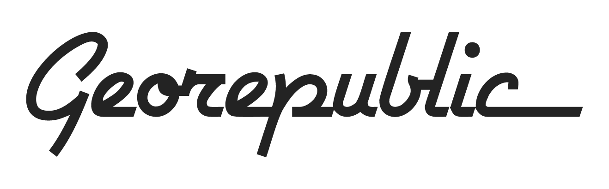

Ichnion is a project led by [Georepublic](https://georepublic.info/), [Tokyo University (IIS)](https://shiba.iis.u-tokyo.ac.jp/), Keio University and [Code4Japan](https://www.code4japan.org/). Its purpose is to allow you to analyze your own data collected from services like Google Takeout, Facebook Export or Twitter Export, whitout uploading it to a 3rd party service. It ensures your data stays with you.

  

    

      
    

    

      
    

    

      
    

  

## Support us

We are looking for people from all over the world to join and collaborate on this project.

[Contact us](../contact) if you are an individual, company or organization that wants to support the project.
