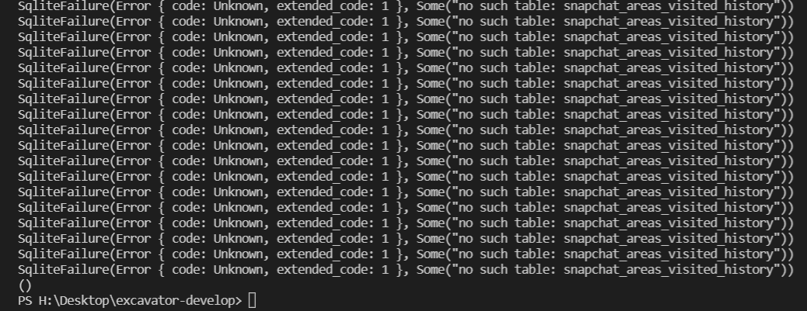
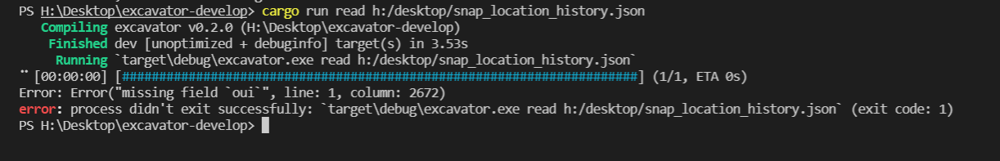
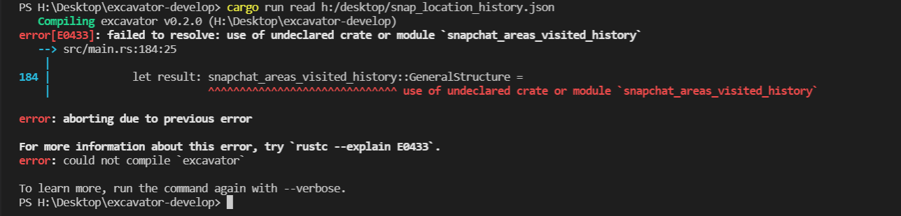
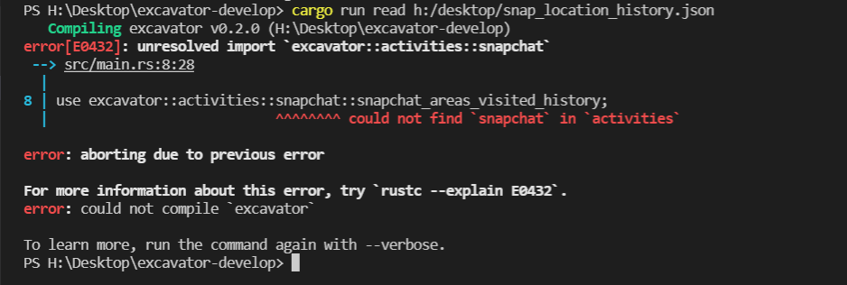
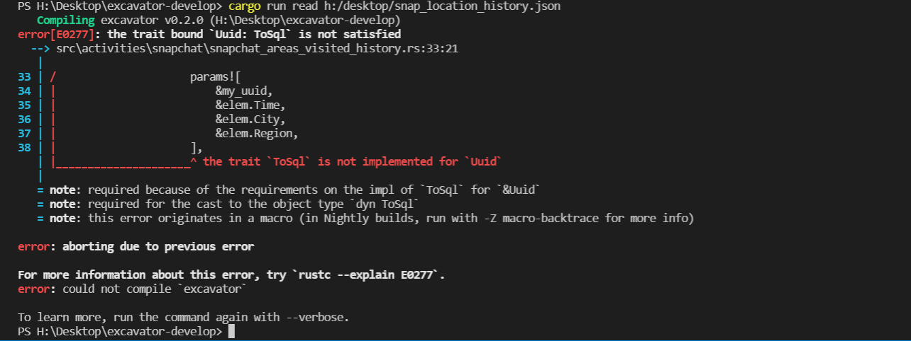
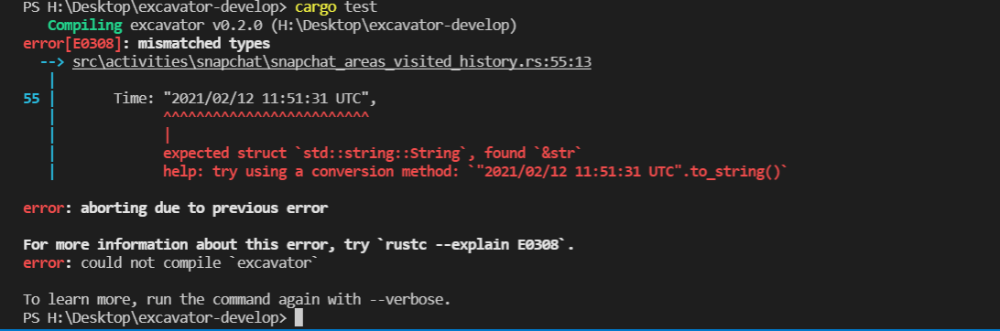

This page is a non-exhaustive list of the errors you may have while programming your own Excavator's function.

We recommand you at first to try to use the compiler. Indeed, the Rust's compiler is very powerful, and can easily correct your code to make it valid.
You can also look at the [Rust documentation](https://doc.rust-lang.org/book/) to solve your problem.
Finally, if you still have errors, you can [contact us on Discord](https://discord.gg/HPFF83fTR4). We will be happy to help you !

## SqliteFailure



An Sqlite error means that there is an issue with your database. It usually comes from a wrong syntax in your database when you create it. You should look at `src/db/schema.rs` if the database is correctly defined : be careful with each word written, each symbol like `,` or `()`. Your syntax must be identical as ours in the [tutorial](../tutorial/index.md).

Another Sqlite error could come from your Primary Key. If you use one of the field of your file as a primary key, verify that each value of this field is different.

## Missing field



If you error's message returns "*missing field ...*", it means that you must have written a wrong name for a field of one of your structure. In our example, we have written "*oui*" instead of *Areas_you_may_have_visited_in_the_last_two_years* into our `GeneralStructure`, but there is not such field named "*oui*" in our `.json` file. This is the reason why we have this error.

:::caution
Remember that each field of your structures must have the same name as a field in your .json file. Please also remember that you can't extract a field if its names is made of more than 1 word (like Postal Code in our tutorial's example).
:::

## Use of undeclared crate or module



This errors means that you forgot to write this line of code in `src/main.rs` :

```rust
use excavator::activities::name_of_the_source::name_of_your_file;
```

In our example :

```rust
use excavator::activities::snapchat::snapchat_areas_visited_history;
```

## Could not find "..." in activities



This means that your forgot to write the following code into `src/activities.rs`

```rust
pub mod name_of_the_source;
pub use name_of_the_source::*;
```

In our example :

```rust
pub mod snapchat;
pub use snapchat::*;
```

## The trait `ToSql` is not implemented for



This errors usually means that you forgot to add a `to_string()` method to a field that needs one (`uuid`, `u64`, ...).

In our example, we just need to write `.to_string()` next to `&my_uuid`.

## expected struct `std::string::String`, found `&str`



This error can happen while you are running your test. It's an error that you may do if you are comfortable with other programming languages. Indeed, a particularity of Rust is that it differentiates *"..."* (`&str`) elements and String. Or we need to add a String to our database, so we need to use a `to_string()` method even on `&str` elements.

In our example, we just need to write `Time: "2021/02/12 11:51:31 UTC".to_string()` instead of `Time: "2021/02/12 11:51:31 UTC"`.
