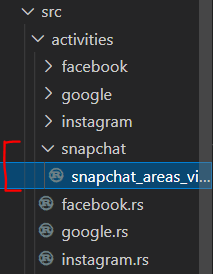
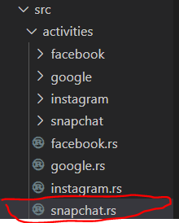
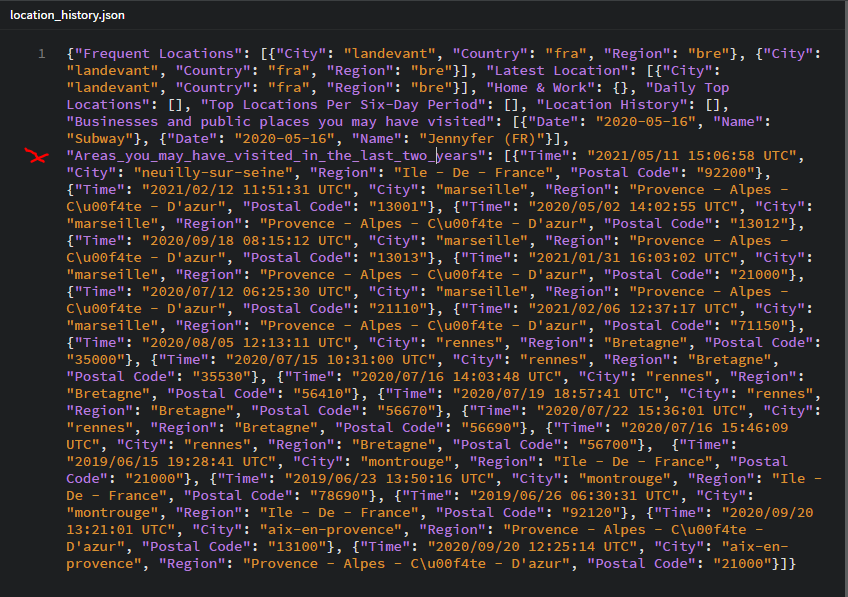
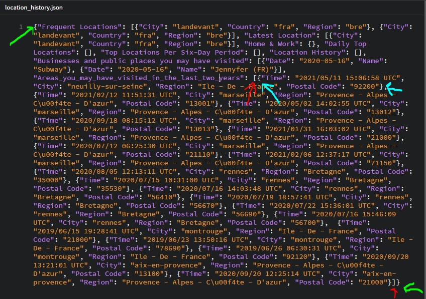
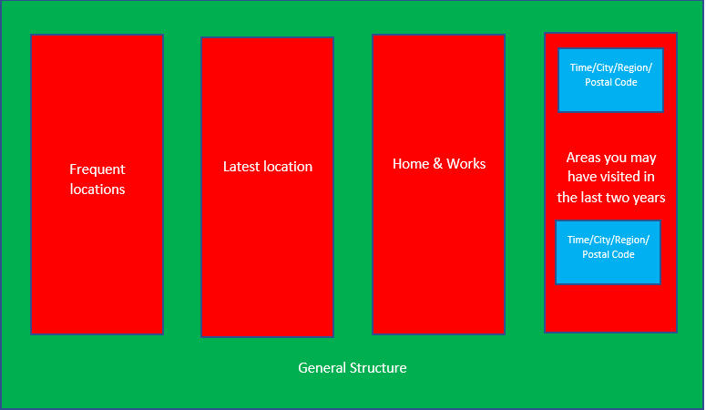
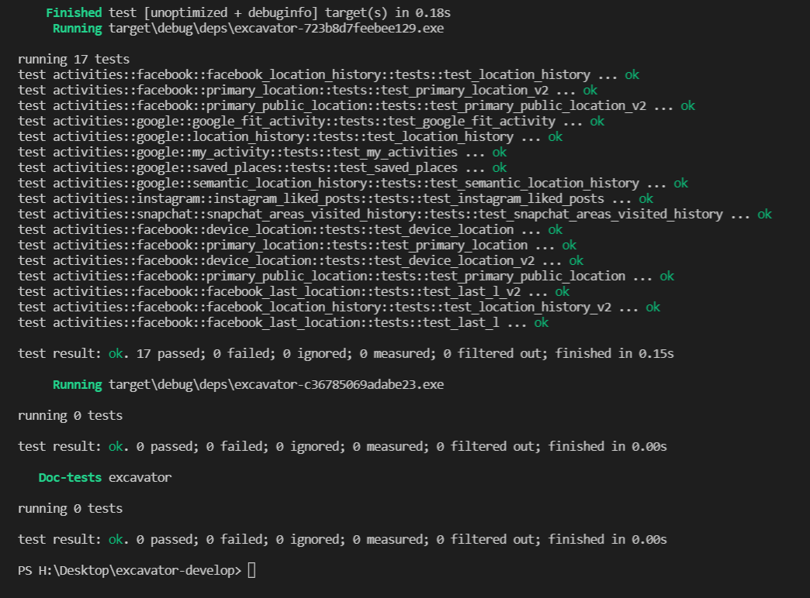

In this little tutorial, we are going to show you how to add new data extraction to Excavator.

## Rust

First of all, you need to know that Excavator uses Rust as programming language.
Rust is known for its safety while programming, with its very useful compiler.
If you want to learn more about Rust, you can look at [this website](https://doc.rust-lang.org/book/)

:::tip
You can use this tutorial without knowing how to code in Rust. However, you should look at the basics to fully understand the structure of Excavator.
:::

## Select your data

You have to select a `.json` file that you want to extract and that is not already supported by Excavator.
For this tutorial, we are going to work with `snapchat_location_history`. Your file will be written as following: `your_file_name`.

## Coding

### Step 1: Start

First, you need to [download the Excavator's repository](https://github.com/ichnion/excavator).
Then open the repository in a code editor (in this tutorial, we use [Visual Studio Code](https://code.visualstudio.com/)).

### Step 2: Check data source

Depending on the file you want to extract, you may act differently:

- if you extract a file from a supported source (Google, Facebook, Instagram, Twitter...):  go to `src/activities/name_of_supported_source` and create a file untitled `name_of_your_file.rs`.

- if you extract a file from a non-supported source : go to `src/activities` and create a new folder `name_of_new_supported_source`. Then create a new file in this new folder untitled `name_of_your_file.rs`.

:::note
When we made this tutorial, there was no Snapchat data added to Excavator yet. So we need first to create a folder `snapchat` and then create a file `snapchat_areas_visited_history.rs` in this folder. (We don't call it snapchat_location_history as we want to collect a particular data untitled `areas_visited` into our `snapchat_location_history` file.)


:::

### Step 3: Check data source (2)

Depending on the file you want to extract, you may act differently :

- if you extract a file from a supported source (Google, Facebook, Instagram, Twitter...) : go to `src/activities/name_of_supported_source.rs` and add the following code :

  ```rust
  pub mod name_of_your_file;
  pub use name_of_your_file::*;
  ```

- if you extract a file from a non-supported source : go to src/activities and create a file untitled name_of_new_supported_source.rs. Then write in this file the following code :

  ```rust
  pub mod name_of_your_file;
  pub use name_of_your_file::*;
  ```

:::note
Like we've seen before, we don't have Snapchat supported yet. We have to create a new file in `src/activities` untitled `snapchat.rs`. Then we write the following code into the file :

```rust
pub mod snapchat_areas_visited_history;
pub use snapchat_areas_visited_history::*;
```


:::

### Step 4: Check data source(3)

Only if you extract a file from a non-supported source : go into **src/activities.rs** and write the following code:

```rust
pub mod name_of_new_supported_source;
pub use name_of_new_supported_source::*;
```

:::note
In our example :

```rust
pub mod snapchat;
pub use snapchat::*;
```
:::

### Step 5: Create the database

You need to open and have a look on your .json file's structure, to identify what info you want to extract.

**EXAMPLE:**



Here is a good example of data : it is pretty hard to read it without using Excavator, and impossible to analyze. (We have reduced the number of lines for this tutorial but your file may be much longer)

For our example, we are going to extract *"Areas_you_may_have_visited_in_the_last_two_years"*. We have to look at the fields we need to extract : for us, it will be `Time`, `City`, `Region` and `Postal Code`. Each file will have different fields, so you will need to adapt your code to your file.


Go to `src/db/schema.rs` and add the following code into the function `create_tables` :

```rust
// name_of_your_file
conn.execute(
  "CREATE TABLE IF NOT EXISTS name_of_your_file (
  )",
  NO_PARAMS,
)
.map_err(|err| println!("{:?}", err))
.ok();
```

In the `()` after the line `CREATE TABLE...` you will need to add your own fields. We use SQlite. You also need to change the name of your database `name_of_your_file`.

**Example:**

We decided to add `Time`, `City`, `Region` and `Postal Code`to our database. The following code is what we need for our example :

```rust
// snapchat_location_history
conn.execute(
  "CREATE TABLE IF NOT EXISTS snapchat_areas_visited_history (
    uuid              TEXT NOT NULL PRIMARY KEY,
    Time              TEXT,
    City              TEXT,
    Region            TEXT,
    Postal_Code       TEXT
  )",
  NO_PARAMS,
)
.map_err(|err| println!("{:?}", err))
.ok();
```

:::note
You have to select one field as a primary key. To be considered as a primary key, a field should not have duplicate data. In our example, we could have chosen `Time` as a Primary Key, because every value of Time is unique in our data. However, we use `uuid` to show you how to do if you have no field candidate to be a Primary Key.
:::

:::note
We only put `TEXT` in our database. It is the easiest way to proceed, as we have a `to_string()` method in Rust. You will see next an example of this method.
:::

:::note
Fields' name have to be composed of only one word. That is the reason why we wrote `Postal_Code` instead of `Postal Code`. 
:::

### Step 6: Create the function

This step is the most technical. You will have to be careful with our explanations, and how your data is.
First, go into `src/activities/name_of_the_source/name_of_your_file.rs`. Then paste the following code :

```rust
use rusqlite::{params, Connection};
use serde::Deserialize;
use uuid::Uuid;

#[allow(non_snake_case)]
impl ... {
  pub fn saveToDb(&self, conn: &Connection) -> Result<(), rusqlite::Error> {
    conn.execute(
      "INSERT INTO your_file_name (
          your_primary_key,
          your_second_field,
          your_third_field,
          ...
        )
        VALUES (?1, ?2, ?3, ...)",
        params![
          ...
        ],
      )
      .map_err(|err| println!("{:?}", err))
      .ok();
    }
    Ok(())
}
```

This is going to be the base of our code.

**EXAMPLE:**

Here is what we write for our example :

```rust
use rusqlite::{params, Connection};
use serde::Deserialize;
use uuid::Uuid;

#[allow(non_snake_case)]
impl ... {
  pub fn saveToDb(&self, conn: &Connection) -> Result<(), rusqlite::Error> {
    conn.execute(
      "INSERT INTO snapchat_location_history (
          uuid,
          Time,
          City,
          Region,
          Postal_Code
          
        )
        VALUES (?1, ?2, ?3, ?4, ?5)",
        params![
          ...
        ],
      )
      .map_err(|err| println!("{:?}", err))
      .ok();
    }
    Ok(())
}
```

Then, you need to go back to the structure of your .json file. Please look carefully at our example:



On the picture, you can see three different arrows. They define the different objects we are going to use in our code. Let's try to make it easier to understand, using boxes.



- The first one (the green) underlines the general structure of our file: `"{}"`. You can see it like a big boxe, where different categories are in: `Frequent Location`, `Latest Location`, `Home & Work`... and finally the one we want to extract in this tutorial : `Areas_you_may_have_visited_in_the_last_two_years`.
- The second one (the red) underlines the structure of the data we want: `[]`. If wanted, we could extract all of them, but in our example, we are only interested in the `Areas_you_may_have_visited_in_the_last_two_years`.
- Finally, the last boxes (the blue) are the elements of the object we want to extract. This is where we find our fields for the database.

:::important
In our code, `{}` objects are represented by `Structures (struct)` and "[]" objects by `Vectors (Vec)`
:::

Let's look at our example to understand what we have to do next. We have the general structure {} (`1`). Inside, there are different [] (`2`) which contain different {} (`3`). If we translate this in our code, we should have : (`1`) a structure of (`2`) vector of (`3`) structures.

```rust
#[rustfmt::skip]
#[allow(non_snake_case)]
#[derive(Deserialize, Debug)]
pub struct GeneralStructure {
  pub Areas_you_may_have_visited_in_the_last_two_years: Vec<SmallerStructure>
}
#[rustfmt::skip]
#[allow(non_snake_case)]
#[derive(Deserialize, Debug)]
pub struct SmallerStructure {
  pub Time: String,
  pub City: String,
  pub Region: String,
  #[serde(rename = "Postal Code")]
  pub Postal: String
}
```

We have a structure `GeneralStructure` (the green boxe) containing a `Vec` (red boxes) of `SmallerStructure` (blue boxes). This `SmallerStructure` itself contains the fields we want (`Time`, `City`, `Region` and `Postal Code`). When you make your code, the fields of structure have to be written in the same way as in the file you are working on. For example, we have written `"Areas_you_may_have_visited_in_the_last_two_years"` just like in our .json file, even if it is a very long name for a field. However, there is a method to manage long names or names composed of two words. Indeed, we should not be able to work with `Postal Code` as its name contains two words, but we can use the following method : `#[serde(rename = "Postal Code")]`. It allows us to give a different name to the field of our structure. We could have done this with the field of our `GeneralStructure`to make it shorter. 

Apply what we did by creating the number of structures you need for your own file, using the code written juste before, and name the fields of structures the same they are untitled in your file.

### Step 7: Create the function (2)

**EXAMPLE :**

Let's see what should be done next.

```rust
#[allow(non_snake_case)]
impl GeneralStructure {
  pub fn saveToDb(&self, conn: &Connection) -> Result<(), rusqlite::Error> {
    for elem in self.Areas_you_may_have_visited_in_the_last_two_years.iter() {
      let my_uuid = Uuid::new_v4();
      conn.execute(
        "INSERT INTO snapchat_areas_visited_history (
                        uuid,
                        Time,
                        City,
                        Region,
                        Postal_Code
                    )
                    VALUES (?1, ?2, ?3, ?4, ?5)",
                params![&my_uuid.to_string(), &elem.Time, &elem.City, &elem.Region, &elem.Postal],
        )
        .map_err(|err| println!("{:?}", err))
        .ok();
      }
      Ok(())
    }
  }
```

You can compare to our previous version of this part of code written at the beginning of step 6.

- line 2: We have to implement our function in the `GeneralStructure`.
- line 4: Then we want to access to each element of the vector we made. The `.iter()` method allows us to do it. You will need a "`for ... in ....iter()`" for each vector you have in your code. Please notice the "`self`" which corresponds to the element from `GeneralStructure` we are working on. For more information, check the [Rust tutorial](https://doc.rust-lang.org/book/).
- line 5: If, like us, `uuid` is your primary key, you have to create a different uuid object for each element of the vector. That is why this line is in the `for{}` method.
- line 7 to 18: instead of the fields from the example, write the name of your own database's elements.

:::tip
If you want to extract some fields which are not TEXT (for example numbers), you can write them as TEXT in your database (in `schema.rs`), then define them as they really are in your structures and apply the `.to_string()` method while adding them to your database. This is exactly what we do with our uuid field in the example.
:::

### Step 8: Test

Keep going, our work is almost finished!
We need to add a testing part to our code. Rust implements a way to test our codes, to verify that everything is going well. If you want to learn more about this, [click here](https://doc.rust-lang.org/book/ch11-00-testing.html).

**EXAMPLE :**

```rust
#[cfg(test)]
mod tests {
  use super::*;
  use rusqlite::Connection;
#[test]
fn test_snapchat_areas_visited_history() -> Result<(), Box<dyn std::error::Error>> {
  let conn = Connection::open("ichnion.db")?;
  let SmallerTest = SmallerStructure {
    Time: "2021/02/12 11:51:31 UTC".to_string(),
    City: "Paris".to_string(),
    Region: "Ile - De - France".to_string(),
    Postal: "75000".to_string(),
  };
  let GeneralTest = GeneralStructure {
    Areas_you_may_have_visited_in_the_last_two_years: vec![SmallerTest],
  };
  let result = GeneralStructure::saveToDb(&GeneralTest, &conn);

  assert_eq!(result, Ok(()));

  Ok(())
}
}
```

- line 6: Rename the function as you want.
- line 8 to 16: For testing our code, we need to give different values to each field we use. You may have to add lines or delete some, depending on your file. You have to define every field you use. Be careful : if you have `TEXT` in your database, you will need to apply the `.to_string()` method to every TEXT field, exactly as we did in our example.

**EXAMPLE :**

We have finished to modify this file. Here is how it looks like at the end:

```rust
use rusqlite::{params, Connection};
use serde::Deserialize;
use uuid::Uuid;

#[rustfmt::skip]
#[allow(non_snake_case)]
#[derive(Deserialize, Debug)]
pub struct GeneralStructure {
  pub Areas_you_may_have_visited_in_the_last_two_years: Vec<SmallerStructure>
}
#[rustfmt::skip]
#[allow(non_snake_case)]
#[derive(Deserialize, Debug)]
pub struct SmallerStructure {
  pub Time: String,
  pub City: String,
  pub Region: String,
  #[serde(rename = "Postal Code")]
  pub Postal: String
}

#[allow(non_snake_case)]
impl GeneralStructure {
  pub fn saveToDb(&self, conn: &Connection) -> Result<(), rusqlite::Error> {
    for elem in self.Areas_you_may_have_visited_in_the_last_two_years.iter() {
      let my_uuid = Uuid::new_v4();
      conn.execute(
        "INSERT INTO snapchat_areas_visited_history (
                        uuid,
                        Time,
                        City,
                        Region,
                        Postal_Code
                    )
                    VALUES (?1, ?2, ?3, ?4, ?5)",
                params![&my_uuid.to_string(), &elem.Time, &elem.City, &elem.Region, &elem.Postal],
        )
        .map_err(|err| println!("{:?}", err))
        .ok();
      }
      Ok(())
    }
  }

#[cfg(test)]
mod tests {
  use super::*;
  use rusqlite::Connection;
#[test]
fn test_snapchat_areas_visited_history() -> Result<(), Box<dyn std::error::Error>> {
  let conn = Connection::open("ichnion.db")?;
  let SmallerTest = SmallerStructure {
    Time: "2021/02/12 11:51:31 UTC".to_string(),
    City: "Paris".to_string(),
    Region: "Ile - De - France".to_string(),
    Postal: "75000".to_string(),
  };
  let GeneralTest = GeneralStructure {
    Areas_you_may_have_visited_in_the_last_two_years: vec![SmallerTest],
  };
  let result = GeneralStructure::saveToDb(&GeneralTest, &conn);

  assert_eq!(result, Ok(()));

  Ok(())
}
}
```

### Step 9: Main function

Finally, this is our last step!
To make our changes available on excavator, we have to modify the main function. Go into `src/main.rs`
On the top of the page, write the following code:

```rust
use excavator::activities::name_of_the_source::name_of_your_file;
```

**EXAMPLE :**

```rust
use excavator::activities::snapchat::snapchat_areas_visited_history;
```

Then at the end of the main's function (and before the "else" part), write the following code:

```rust
//name_of_data_source
else if f_name.starts_with("name_of_your_file.json") {
  println!("processing {}", d_name);

  let rawdata = std::fs::read_to_string(&entry.path())?;

  let result: name_of_your_file::name_of_your_GeneralStructure =
    serde_json::from_str(&rawdata)?;
  let response = result.saveToDb(&conn)?;
  println!("{:?}", response);
}
```

You need to modify :
- line 1: write your own `name_of_data_source`
- line 2: write your own `name_of_your_file.json`
- line 5: write your own `name_of_your_file::name_of_your_GeneralStructure`

**EXAMPLE :**

```rust
//Snapchat
else if f_name.starts_with("snap_location_history.json") {
  println!("processing {}", d_name);

  let rawdata = std::fs::read_to_string(&entry.path())?;

  let result: snapchat_areas_visited_history::GeneralStructure =
      serde_json::from_str(&rawdata)?;
  let response = result.saveToDb(&conn)?;
  println!("{:?}", response);
}
```

Finished! (Actually, almost...)
Open a terminal and type `cargo test`. If you have made no mistake since the beginning of this tutorial, you should see the following screen:



Then you can finally extract your data, using your own work. Type in the terminal `cargo run read path_of_your_file`.

If you have some error's messages, the compiler will help you to solve your problem. However, if you need help, you can refer to the [common error's page](../errors/index.md) or [contact us on Discord](https://discord.gg/HPFF83fTR4).

Finally, you can write in the terminal `cargo fmt --all` and then make a [pull request](https://github.com/ichnion/excavator). We will review your code, and if there is no problem, add it to the Excavator's project. Well done!
