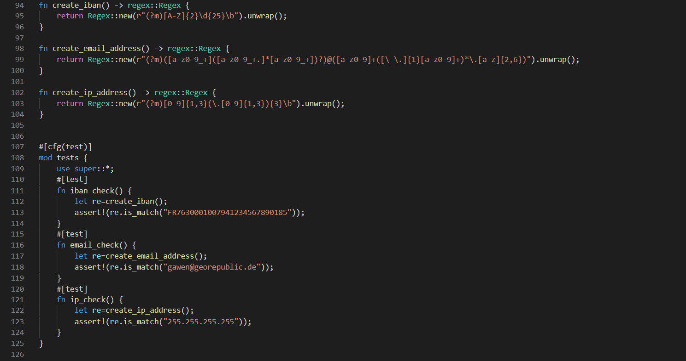
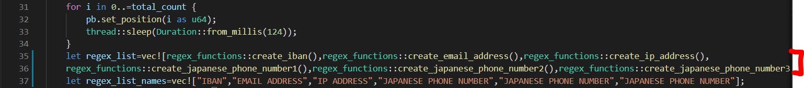

# How to contribute to sieving?

It is really easy to contribute to this tool. 
First, you need to have [Rust installed](https://www.rust-lang.org/).
Then, you need to understand how do Regular Expressions work (particularly in Rust). You can read [this page](https://docs.rs/regex/1.5.4/regex/).
Finally, download the lastest version of the Sieving's code on [our Github page](https://github.com/ichnion/sieving).

---

Open `src/regex_functions.rs`. You should see this: 


Create your own function below the other ones: line 27 on the picture. For example, if you want to add `Japanese driving license's number` to the list of data to hide:
```sh
fn create_japanese_driving_license_number() -> regex::Regex {
    return Regex::new(r"YOUR_REGEX").unwrap();
}
```
Please respect the syntax we use.

Then you have to write a test to your function. Put the following code next to the other tests (at the bottom of the code, before the last token):
```sh
#[test]
    fn japanese_driving_license_number_check() {
        let re=create_ip_address();
        assert!(re.is_match("123456789000"));
    }
```
Obviously, you will have to change the value in the `assert!(re.is_match(""))` method depending on what data are you adding to the scanner.

Once you have done this, you only need to go at te beginning of the `main.rs` code:


`line 35`: add the name of the function you just created in the vector, following this syntax: `regex_functions::name_of_your_function`.
`line 37`: add the name of the data you just added to the scanner in the vector.

With our example of `Japanese driving license number`:
```sh
    let regex_list=vec![regex_functions::create_iban(),regex_functions::create_email_address(),regex_functions::create_ip_address(),
    regex_functions::create_japanese_phone_number1(),regex_functions::create_japanese_phone_number2(),regex_functions::create_japanese_phone_number3(),
    regex_functions::create_japanese_driving_license_number()];
    let regex_list_names=vec!["IBAN","EMAIL ADDRESS","IP ADDRESS","JAPANESE PHONE NUMBER","JAPANESE PHONE NUMBER","JAPANESE PHONE NUMBER", JAPANESE DRIVING LICENSE NUMBER];
```
Finished! You can then make a pull request of your code on [Github](https://github.com/ichnion/sieving).

If you need any help, you can easily [contact us on Discord](https://discord.gg/HPFF83fTR4).
