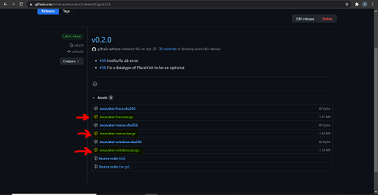
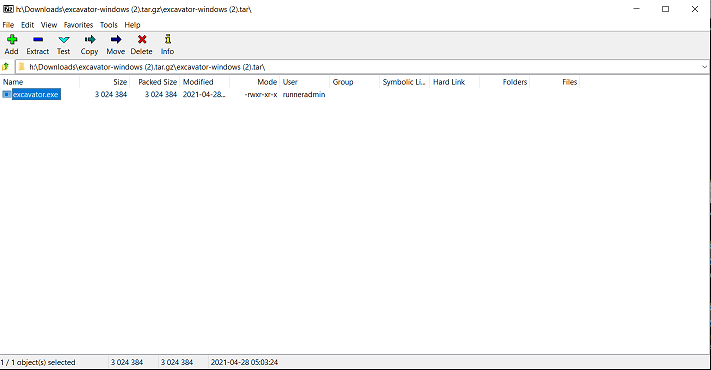
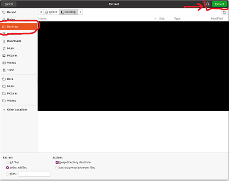

:::important

There are different methods to install Excavator, and it depends on your profile to select how you are going to install it. If you are not a developer, please refer to the "Non-Developer Guide". Otherwise, please follow the instructions from the "Developer guide".  

:::

## Non-Developer Guide 

Go to [our GitHub page](https://github.com/ichnion/excavator/releases). 



As you can see on the screenshot, there are different files in the "Assets" part of the current release (v0.2.0 when we are writing this).
The three files with the `.tar.gz` extension are the ones we are looking for. The next step will depend on which OS you are using.

#### Windows 

Click on `excavator-windows.tar.gz`. Once it is downloaded, you need to unzip the file. For this tutorial, we are using 7Zip. 



Put this file in `C:\Windows\System32`, and the installation is completed. You should now be able to use Excavator in a terminal.

#### Linux 

Click on `excavator-linux.tar.gz`. Once it is downloaded, extract it wherever you want. In our case, we extract it in `Desktop`. 



Finally, open a terminal and type the following command `sudo cp PATH_TO_EXCAVATOR /usr/local/bin` (replace `PATH_TO_EXCAVATOR` by the path to where you extracted excavator in the previous step).

The installation is completed, you should now be able to use Excavator in a terminal.

#### MacOS 

Click on `excavator-linux.tar.gz`. Once it is downloaded, extract it in `usr/local/bin`.  

The installation is completed, you should now be able to use Excavator in a terminal.

---

## Developer Guide

The easiest way to install Excavator is using a package registry like crates.io:

```sh
$ cargo install excavator
```

In case you are using MacOS you can also install the package from Homebrew:

```sh
$ brew tap ichnion/tap
$ brew install excavator
```

### Compiling from source

You need to have a [package manager](https://doc.rust-lang.org/cargo/appendix/glossary.html#package-manager) called [cargo](https://doc.rust-lang.org/cargo/) in your local.

If you already have got `rustc` installed in your local, you also have `cargo` installed locally.

And then you can install with this command.

```sh
$ cargo install --git https://github.com/ichnion/excavator --branch develop
```

### MacOS

Open the terminal from the applications folder or press command + spacebar to access spotlight and type “terminal”. Paste the following into the command line:

```sh
curl --proto '=https' --tlsv1.2 https://sh.rustup.rs -sSf | sh
```
This command downloads a script and starts the installation of the rustup tool, which installs the latest stable version of [Rust](https://doc.rust-lang.org/book/ch00-00-introduction.html), the programming language which excavator is based on.

When asked about current installation options press “1” to choose "Proceed with installation (default)"

Rust is installed now. Great!

To continue you need Rusts's package manager called [Cargo](https://doc.rust-lang.org/book/ch01-03-hello-cargo.html) and put the bin directory ($HOME/.cargo/bin) in your PATH environment variable. To do that, paste the following line:

```sh
source $HOME/.cargo/env
```

next, paste the following:
```sh
cargo install excavator
```

This might take a couple of minutes.

Now that you’re setup, let’s take a look at how to get your data from a web service !
